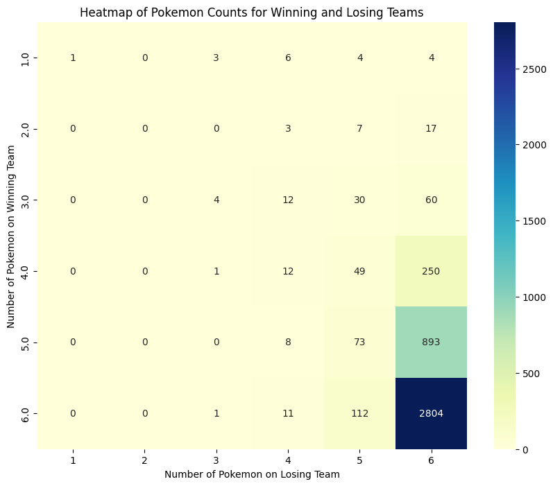
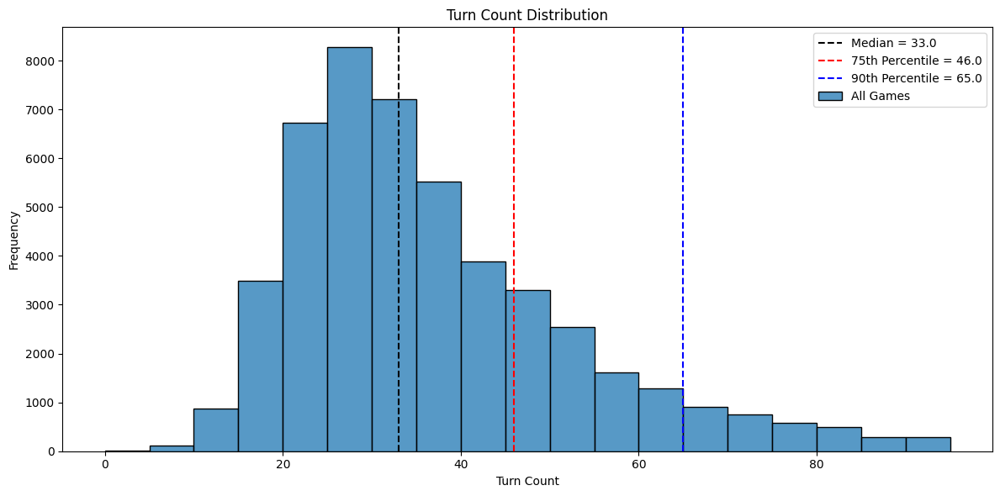
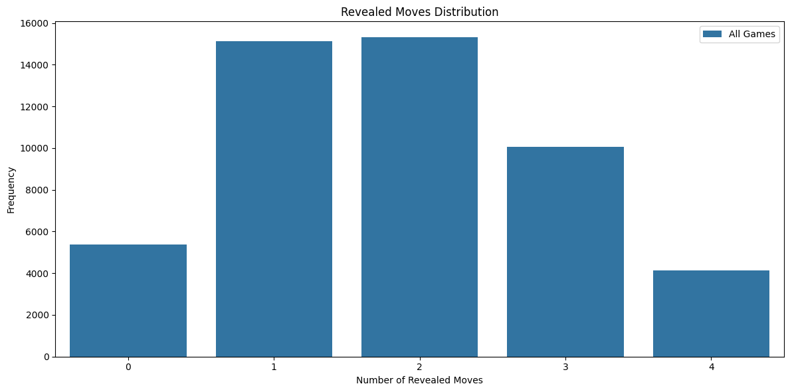

# ADV Revival 2 Summary

## Table of Contents
1. [Background](#background)
2. [General Analysis](#general-analysis)
3. [Statistical Analysis](#statistical-analysis)
4. [Conclusions](#conclusions)

## Background
[ADV Revival 2](https://youtu.be/mPNWXh-YwJE?si=dD1SDCZ0zD9bS984) was a Pokemon tournament hosted by [Jimothy Cool](https://www.youtube.com/@jimothycool) and the [Revival Tournaments](https://www.youtube.com/@RevivalTournaments) YouTube Channel. This tournament uses the ADV OU metagame rulesets (with some minor modifications to limit high-luck playstyles). ADV OU consists of most of the pokemon available in the 3rd generation games (Ruby, Sapphire, Emerald era) with a few legendary pokemon excluded. With over 700 players this is the largest ever tournament for this ruleset. As such, it's a unique opportunity to delve deeper into a large series of games and pull out some statistical relationships. As part of the tournament players submitted their replays, these replays are helpfully stored in a .json format which can be machine read to extract important information.

## General Analysis

### Usage Rates

First off we have the top 10 pokemon in terms of overall usage rates. This list shouldn't be too unusual to anyone who has played ADV OU before.

|  Pokemon  | Usage Rate |
|-----------|:----------:|
| Tyranitar |   0.545216 |
| Metagross |   0.397694 |
|  Swampert |   0.375999 |
|  Skarmory |   0.362069 |
|    Zapdos |   0.334095 |
|   Blissey |   0.304864 |
| Salamence |   0.294017 |
|    Celebi |   0.247088 |
|   Suicune |   0.243092 |
|    Gengar |   0.239667 |

### Distribution of Revealed Pokemon

Below is a heatmap of the different numbers of revealed pokemon. As you can see, the majority of games are 6-6 with a large number of 5-6. As would be expected in a tournament setting but not necessarily a more casual setting there are very few forfeits where the loser has less than 6 revealed pokemon.

### Distribution of Turn Count

Below is a histogram of the number of turns each match took. If you're familiar with common distributions you may recognize this as being Weibull shaped (with a shape parameter > 1). This makes sense as what we are measuring is essentially the "time to game end" and the likelihood of the game ending gets higher every turn. This is analogous to the type of "time to failure" analysis for a part which experiences increased likelihood of failure as it ages which Weibulls are often used for.

### Average Number of Moves Used

Another flaw with the use of replays instead of full logs is that you only know the moves a pokemon used and not the moves they had but never moved. That said, I looked at how many moves a pokemon used on average. Again, this list is filtered to only pokemon who showed up on at least 5% of teams.

| Top 5      | Avg # of Used Moves | Bottom 5   | Avg # of Used Moves |
|------------|:-------------------:|------------|:-------------------:|
|   Venusaur |            2.472222 |    Dugtrio | 0.950224            |
|    Blissey |            2.453558 |    Marowak | 1.197368            |
|       Jynx |            2.369565 | Aerodactyl | 1.255756            |
| Misdreavus |            2.358209 |   Magneton | 1.322802            |
|   Smeargle |            2.326087 |     Raikou | 1.414286            |

## Statistical Analysis

With all this data I thought it was an excellent chance to see if we could learn anything about what pokemon and/or moves were most likely to change the outcomes of games.

### Pokemon Win Rates
Filtering all pokemon showing up in at least 5% of teams, I did a series of Fisher's Exact Tests to compare the win rates between teams that had that pokemon and teams that did not. Importantly, mirror matches (where both players are using a given pokemon) must be removed. These inhernetly count as 1 win and 1 loss and bias the odds ratio towards 1.0 the higher the frequency of mirror matches is, independent of how the pokemon performs in non-mirror matches.

Ultimately I found that there are 7 pokemon which have a statistically significant effect on win rates (after a Bonferroni correction). In the below table the odds ratio is how much more or less likely you are to win a game if you reveal one of the below pokemon. So in this case, having a (revealed) Heracross on your team makes you 0.465 times as likely to win as if you didn't have a revealed Heracross.

|  Pokemon   | Odds Ratio | p-value   |
|------------|:----------:|:---------:|
| Heracross  | 0.465304   | 6.242e-10 |
| Hariyama   | 0.545136   | 6.649e-05 |
| Moltres    | 0.582949   | 2.630e-05 |
| Aerodactyl | 0.664321   | 1.404e-07 |
| Gengar     | 0.701222   | 6.428e-07 |
| Metagross  | 0.715763   | 9.898e-08 |
| Magneton   | 0.721341   | 6.945e-05 |

### Move Influence on Win Rates
I did a series of similar tests looking at all pokemon/move combinations that showed up on at least 5% of teams. I compared the win rate of the pokemon who used that move vs the win rate who did not and found 3 significant results (again after a Bonferroni correction).

|  Pokemon   | Move       |Odds Ratio| p-value   |
|------------|------------|:--------:|:---------:|
| Aerodactyl | Rock Slide | 0.590967 | 5.742e-06 |
| Metagross  | Earthquake | 1.455647 | 3.750e-05 |
| Celebi     | Giga Drain | 1.540637 | 4.092e-05 |
| Skarmory   | Spikes     | 1.857487 | 2.017e-05 |

These options make somewhat intuitive sense to me. Giga drain on Celebi is a semi-uncommon move, if you decide to use it you likely have a good target in front of you can (and often will) hit. Metagross using earthquake likely means you're in a leading position where most/all of the opponents flyers have been eliminated and the 100% accuracy of earthquake is worth the lack of attack raise upside from meteor mash. Skarmory improving win rates when uses spikes is more about win rates plummeting when it doesn't get to use spikes. If a Skarmory doesn't manage to get spikes down what was the point? It may have just died to Magneton and did nothing else. Aerodactyl Rock slide making things worse is interesting. My best guess is that a rock slide isn't usually the best choice to hit anything but flyers. But it's also so obvious that if they have any other option they'll likely switch to a rock resist and then you have to switch out the next turn. In many cases it's probably safer to predict the switch and switch yourself or use double edge/earthquake.

### Limiting to Upper Pool Play and Final Bracket
Many of the best ADV players participated in ADV Revival 2, but so did many people who are much less good. As a final test I looked at if there was a difference in the win rates when including only games after the first 5 rounds (~800 games) or only games in the final bracket (~50).

In both cases, a chi squared test showed that the higher level players bring different pokemon than the overall tournament. And further post-hoc testing showed 4 pokemon for which that relationship was significant.

|  Pokemon   | Filter        |Odds Ratio| p-value  |
|------------|---------------|:--------:|:--------:|
| Aerodactyl | After Round 5 | 0.762793 | 2.117e-4 |
| Hariyama   | After Round 5 | 0.530813 | 5.9297-5 |
| Jirachi    | After Round 5 | 1.395924 | 4.471e-7 |
| Milotic    | Final Bracket | 3.476509 | 6.771e-5 |

When looking at these smaller subsets only, no Pokemon showed a statistically significant relationship on overall win rates in either directly. However, the sample size does make that a considerably higher bar to meet.

## Conclusions
The takeaways I have from this project are
1. Heracross, Aerodactyl, Gengar, and Metagross are often misused by lower level players
2. Clicking Rock Slide is often a mistake with Aerodactyl
3. Most pokemon use only 1 or 2 moves in a single game
4. The best players like Milotic a lot more than the general public
5. Collecting more data from high level players will give a larger sample side and show interesting results among the very best teams
